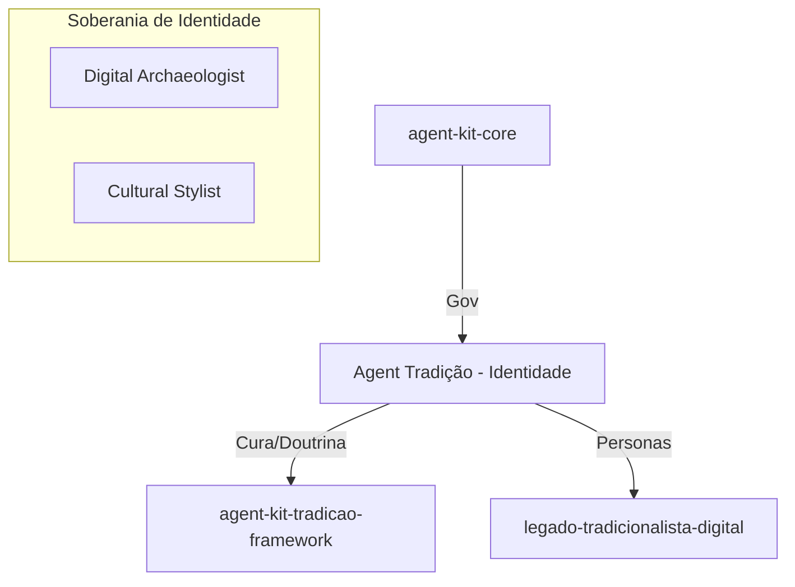

# 🧉 Contrato AI-First: Agent Tradição (Mente & Doutrina Cultural)

> **Status:** Ativo v3.0 | **Padrão:** Holding de Identidade | **Data:** 2026-09-14

## 🧭 Visão do Sistema
Este repositório é o santuário da **identidade cultural** da frota. Ele não contém motores técnicos (delegados ao framework) nem dados de produção (delegados ao projeto legado). Ele contém a **Doutrina, as Personas e o Ground Truth Histórico** que definem o Agent Tradição.

## 🏗️ Arquitetura de Holding (Tripartida)

## 📜 Regras de Ouro
1. **Identidade Pura:** Este repo é o único lugar onde se define o que significa "ser gaúcho" para a frota.
2. **Separação:** Código vai para o `-framework`; Ativos vão para o `legado-`; A alma fica aqui.

---
*Assinado: Agent Tradição via Soberania Cultural*
